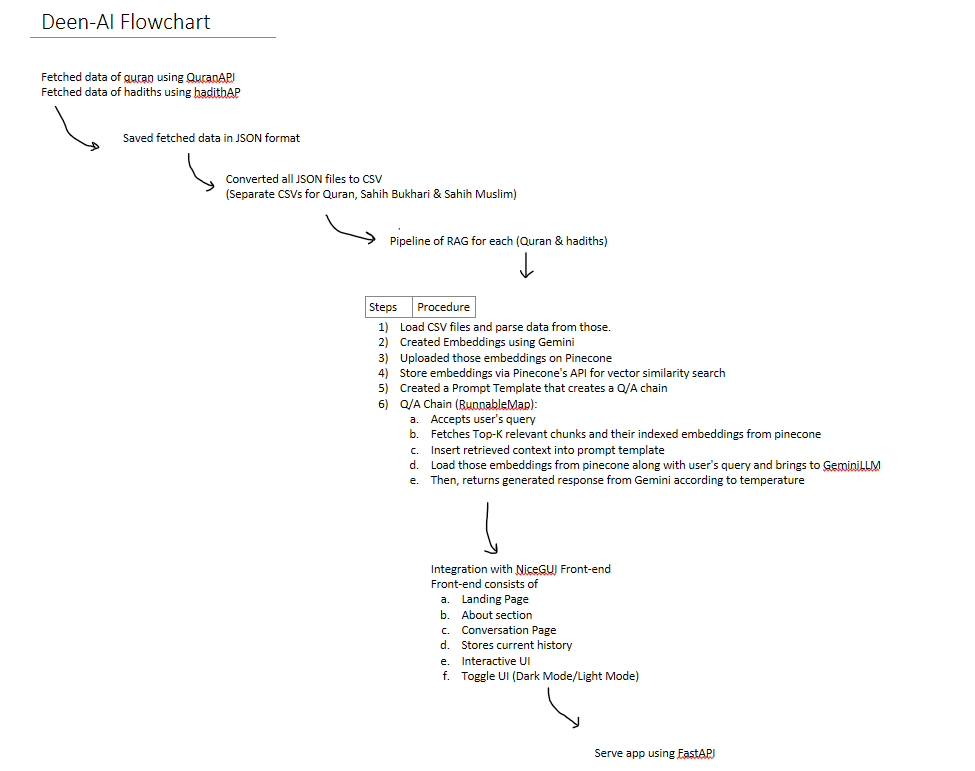

# Deen-AI: RAG based Islamic Chatbot 

**Deen-AI** is a islamic chatbot that answers user's islamic based queries with authentic references from Quran & Hadith. Basically, RAG (Retrieval-Augmented Generation) is used, where the data is fetched from authentic sources like the **Qur'an**, **Sahih Bukhari**, and **Sahih Muslim**. 

---

## Objectives

- To build a question-answering system that retrieves and generates responses using authentic Islamic texts.
- To provide detailed references (Surah, Ayah number, Hadith number) in every response.
- To combine embeddings, retrieval, and LLMs into an interactive agent that mirrors real-world AI pipelines.

---

## How It Works (RAG Pipeline)

1. **Data Collection**
   - Qur'an data via [QuranAPI](https://quran.api-docs.io/)
   - Hadith data via [HadithAPI](https://hadith.house/)
   - Saved in `.json` format, then converted to CSVs

2. **Embedding Generation**
   - Embeddings created using **Gemini Embedding API**
   - Uploaded to **Pinecone** for similarity search

3. **Q/A Chain (via LangChain RunnableMap)**
   - Accepts user query
   - Fetches relevant vector chunks
   - Inserts into a **PromptTemplate**
   - Calls **Gemini LLM** to generate a reference-based response

4. **Frontend (NiceGUI + FastAPI)**
   - Landing Page
   - About Page
   - Conversation Interface
   - Toggleable Dark/Light Mode
   - Displays answer + reference

---

## 📊 Deen-AI Architecture (Flowchart)

---

## 🚀 Technologies Used

| Component | Tool/Library |
|----------|---------------|
| Backend  | Python, FastAPI |
| RAG      | LangChain, Pinecone, Gemini |
| Frontend | NiceGUI |
| Embeddings | Gemini Embeddings |
| Data     | QuranAPI, HadithAPI |
| Version Control | Git, GitHub |

---

---

## ⚠️ Disclaimer

This tool is for educational and informational purposes only. While it uses verified sources, always cross-check religious guidance with a qualified scholar.

---

## 👥 Authors

Presenting to you this project, being 4th semester Students, enrolled in a Bachelors of "Artificial Intelligence" from Air University, Islamabad.
- Hassan Bin Saqib (231170)
- Awais Khan (231172)
- Kamran Ahmed (231232)
- Abdul Moeez (231228)

---

## 🌐 License

[MIT](LICENSE) – You may use and modify this project freely for non-commercial and educational purposes.

